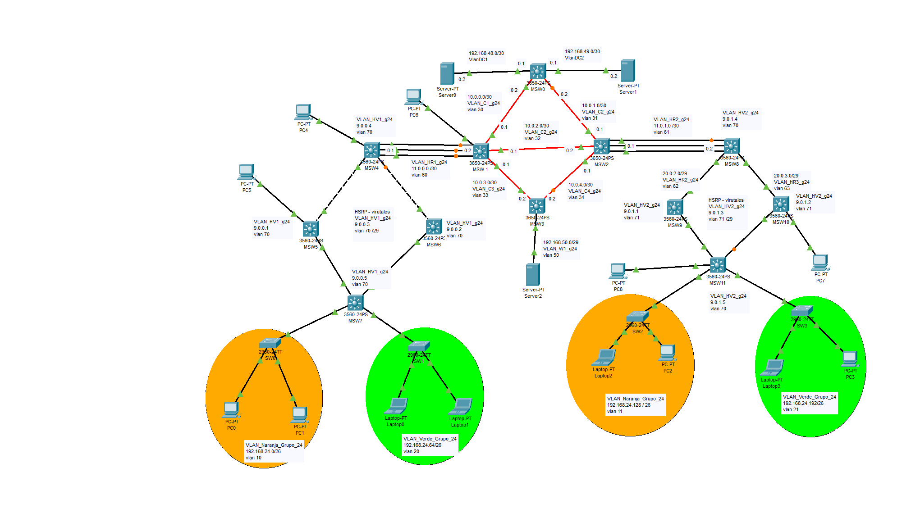

# Proyecto 1 - Grupo 24

## Integrantes: 
| Carnet    | Nombre                         |
| :-------- | :----------------------------- |
| 201431457 | Damihan Antonio Morales Cuyuch |


## Topología presentada

# Configuracion

## Configuración general 
### MSW0
```bash
Switch>enable
Switch#conf t 
Switch(config)#hostname MSW0
MSW0(config)#no ip domain-lookup
MSW0(config)#do write

```

### MSW1
```bash
Switch>enable
Switch#conf t 
Switch(config)#hostname MSW1
MSW1(config)#no ip domain-lookup
MSW1(config)#do write
```
### MSW2
```bash
Switch>enable
Switch#conf t 
Switch(config)#hostname MSW2
MSW2(config)#no ip domain-lookup
MSW2(config)#do write
```

### MSW3
```bash
Switch>enable
Switch#conf t 
Switch(config)#hostname MSW3
MSW3(config)#no ip domain-lookup
MSW3(config)#do write
```

### MSW4
```bash
Switch>enable
Switch#conf t 
Switch(config)#hostname MSW4
MSW4(config)#no ip domain-lookup
MSW4(config)#do write
```

### MSW5
```bash
Switch>enable
Switch#conf t 
Switch(config)#hostname MSW5
MSW5(config)#no ip domain-lookup
MSW5(config)#do write
```

### MSW6
```bash
Switch>enable
Switch#conf t 
Switch(config)#hostname MSW6
MSW6(config)#no ip domain-lookup
MSW6(config)#do write
```

### MSW7
```bash
Switch>enable
Switch#conf t 
Switch(config)#hostname MSW7
MSW7(config)#no ip domain-lookup
MSW7(config)#do write
```

### MSW8
```bash
Switch>enable
Switch#conf t 
Switch(config)#hostname MSW8
MSW8(config)#no ip domain-lookup
MSW8(config)#do write
```

### MSW9
```bash
Switch>enable
Switch#conf t 
Switch(config)#hostname MSW9
MSW9(config)#no ip domain-lookup
MSW9(config)#do write
```

### MSW10
```bash
Switch>enable
Switch#conf t 
Switch(config)#hostname MSW10
MSW10(config)#no ip domain-lookup
MSW10(config)#do write
```

### MSW11
```bash
Switch>enable
Switch#conf t 
Switch(config)#hostname MSW11
MSW11(config)#no ip domain-lookup
MSW11(config)#do write
```

### SW0
```bash
Switch>enable
Switch#conf t 
Switch(config)#hostname SW0
SW0(config)#no ip domain-lookup
SW0(config)#do write
```
### SW1
```bash
Switch>enable
Switch#conf t 
Switch(config)#hostname SW1
SW0(config)#no ip domain-lookup
SW0(config)#do write
```

### SW2
```bash
Switch>enable
Switch#conf t 
Switch(config)#hostname SW2
SW0(config)#no ip domain-lookup
SW0(config)#do write
```
### SW3
```bash
Switch>enable
Switch#conf t 
Switch(config)#hostname SW3
SW0(config)#no ip domain-lookup
SW0(config)#do write
```

## LACP

### MSW1
```bash
MSW1#conf t
MSW1(config)#interface range gigabitEthernet 1/0/1-3
MSW1(config-if-range)#switchport trunk allowed vlan all
MSW1(config-if-range)#channel-group 1 mode active
MSW1(config-if-range)#no shutdown 
MSW1(config-if-range)#exit
## configuracion de enlace troncal
MSW1(config)#interface Port-channel 1
MSW1(config-if)#switchport mode trunk
MSW1(config-if)#exit

```

### MSW2
```bash
MSW1#conf t
MSW2(config)#interface range gigabitEthernet 1/0/1-3
MSW2(config-if-range)#switchport trunk allowed vlan all
MSW2(config-if-range)#channel-group 2 mode active
MSW2(config-if-range)#no shutdown 
MSW2(config-if-range)#exit
## configuracion de enlace troncal
MSW2(config)#interface Port-channel 2
MSW2(config-if)#switchport mode trunk
MSW2(config-if)#

```


### MSW4
```bash
MSW4#conf t
MSW4(config)#interface range fastEthernet 0/1-3
MSW4(config-if-range)#switchport trunk encapsulation dot1q 
MSW4(config-if-range)#switchport trunk allowed vlan all
MSW4(config-if-range)#channel-group 1 mode active
MSW4(config-if-range)#no shutdown 
MSW4(config-if-range)#exit
## configuracion de enlace troncal
MSW4(config)#interface Port-channel 1
MSW4(config-if)#switchport mode trunk
MSW4(config-if)#

```

### MSW8
```bash
MSW8#conf t
MSW8(config)#interface range fastEthernet 0/1-3
MSW8(config-if-range)#switchport trunk encapsulation dot1q 
MSW8(config-if-range)#switchport trunk allowed vlan all
MSW8(config-if-range)#channel-group 2 mode active
MSW8(config-if-range)#no shutdown 
MSW8(config-if-range)#exit
## configuracion de enlace troncal
MSW8(config)#interface Port-channel 2
MSW8(config-if)#switchport mode trunk
MSW8(config-if)#

```


## Configuracion Vlans


### MSW1 (server)
```bash 
MSW1> enable
MSW1# configure terminal
MSW1(config)# vtp mode server
MSW1(config)# vtp version 2
MSW1(config)# vtp domain g24
MSW1(config)# vtp password redes2grupo24
MSW1(config)# do write
## configuración de vlans
MSW1> enable 
MSW1# configure terminal 
MSW1(config)# vlan  10
MSW1(config-vlan)# name VLAN_Naranja_g24_e1
MSW1(config-vlan)# exit
MSW1(config)# vlan  11
MSW1(config-vlan)# name VLAN_Naranja_g24_e2
MSW1(config-vlan)# exit
MSW1(config)# vlan  20
MSW1(config-vlan)# name VLAN_Verde_g24_e1
MSW1(config-vlan)# exit
MSW1(config)# vlan  21
MSW1(config-vlan)# name VLAN_Verde_g24_e2
MSW1(config-vlan)# exit
MSW1(config)# vlan  30
MSW1(config-vlan)# name VLAN_C1_g24
MSW1(config-vlan)# exit
MSW1(config)# vlan  31
MSW1(config-vlan)# name VLAN_C2_g24
MSW1(config-vlan)# exit
MSW1(config)# vlan  32
MSW1(config-vlan)# name VLAN_C3_g24
MSW1(config-vlan)# exit
MSW1(config)# vlan  33
MSW1(config-vlan)# name VLAN_C4_g24
MSW1(config-vlan)# exit
MSW1(config)# vlan  33
MSW1(config-vlan)# name VLAN_C4_g24
MSW1(config-vlan)# exit
MSW1(config)# vlan  40
MSW1(config-vlan)# name VLAN_DC1_g24
MSW1(config-vlan)# exit
MSW1(config)# vlan  41
MSW1(config-vlan)# name VLAN_DC2_g24
MSW1(config-vlan)# exit
MSW1(config)# vlan  50
MSW1(config-vlan)# name VLAN_W1_g24
MSW1(config-vlan)# exit
MSW1(config)# do write


```

### MS0 , MS2-MS11, SW0-SW3
Cofiguración de switch como cliente
```bash
SW5_G24> enable
SW5_G24# configure terminal
SW5_G24(config)# vtp domain g24
SW5_G24(config)# vtp password redes2grupo24
SW5_G24(config)# vtp mode client 
SW5_G24(config)# do write
```

## Configuracion Puertos Troncales
Configuración de los enlaces troncales dentro de la topologia 


### MSW0
```bash
MSW0>enable
MSW0#conf t
MSW0(config)#interface gigabitEthernet 1/1/1
MSW0(config-if)#switchport mode trunk 
MSW0(config-if)##switchport trunk allowed vlan all
MSW0(config-if)#exit
MSW0(config)#interface gigabitEthernet 1/1/2
MSW0(config-if)#switchport mode trunk 
MSW0(config-if)##switchport trunk allowed vlan all
MSW0(config-if)#exit
MSW0(config)#interface gigabitEthernet 1/0/1
MSW0(config-if)#switchport mode trunk 
MSW0(config-if)##switchport trunk allowed vlan all
MSW0(config-if)#exit
MSW0(config)# do write
```

### MSW1
```bash
MSW1>enable
MSW1#conf t
MSW1(config)#interface gigabitEthernet 1/1/1
MSW1(config-if)#switchport mode trunk 
MSW1(config-if)##switchport trunk allowed vlan all
MSW1(config-if)#exit
MSW1(config)#interface gigabitEthernet 1/1/2
MSW1(config-if)#switchport mode trunk 
MSW1(config-if)##switchport trunk allowed vlan all
MSW1(config-if)#exit
MSW1(config)#interface gigabitEthernet 1/1/3
MSW1(config-if)#switchport mode trunk 
MSW1(config-if)##switchport trunk allowed vlan all
MSW1(config-if)#exit
MSW1(config)# do write
```

### MSW2
```bash
### MSW1
MSW2>enable
MSW2#conf t
MSW2(config)#interface gigabitEthernet 1/1/1
MSW2(config-if)#switchport mode trunk 
MSW2(config-if)##switchport trunk allowed vlan all
MSW2(config-if)#exit
MSW2(config)#interface gigabitEthernet 1/1/2
MSW2(config-if)#switchport mode trunk 
MSW2(config-if)##switchport trunk allowed vlan all
MSW2(config-if)#exit
MSW2(config)#do write
```

### MSW3
```bash
### MSW1
MSW3>enable
MSW3#conf t
MSW3(config)#interface gigabitEthernet 1/0/1
MSW3(config-if)#switchport mode trunk 
MSW3(config-if)##switchport trunk allowed vlan 50
MSW3(config-if)#exit
MSW3(config)#do write
```

### MSW4
```bash
MSW4>enable
MSW4#conf t
MSW4(config)#interface fastEthernet 0/10
MSW4(config-if)#switchport trunk encapsulation dot1q 
MSW4(config-if)#switchport mode trunk 
MSW4(config-if)#switchport trunk allowed vlan all
MSW4(config-if)#exit
MSW4(config)#interface fastEthernet 0/11
MSW4(config-if)#switchport trunk encapsulation dot1q 
MSW4(config-if)#switchport mode trunk 
MSW4(config-if)#switchport trunk allowed vlan all
MSW4(config-if)#exit
MSW4(config)#do write
```

### MSW8
```bash
MSW>enable
MSW#conf t
MSW(config)#interface fastEthernet 0/10
MSW(config-if)#switchport trunk encapsulation dot1q 
MSW(config-if)#switchport mode trunk 
MSW(config-if)#switchport trunk allowed vlan all
MSW(config-if)#exit
MSW(config)#interface fastEthernet 0/11
MSW(config-if)#switchport trunk encapsulation dot1q 
MSW(config-if)#switchport mode trunk 
MSW(config-if)#switchport trunk allowed vlan all
MSW(config-if)#exit
MSW(config)#do write
```

### MSW5
```bash
MSW5>enable
MSW5#conf t
MSW5(config)#interface f0/1 
MSW5(config-if)#switchport trunk encapsulation dot1q 
MSW5(config-if)#switchport mode trunk 
MSW5(config-if)#switchport trunk allowed vlan all
MSW5(config-if)#no shutdown 
MSW5(config-if)# exit
MSW5(config)# do write
```

### MSW6
```bash
MSW6>enable
MSW6#conf t
MSW6(config)#interface f0/2
MSW6(config-if)#switchport trunk encapsulation dot1q 
MSW6(config-if)#switchport mode trunk 
MSW6(config-if)#switchport trunk allowed vlan all
MSW6(config-if)#no shutdown 
MSW6(config-if)# exit
MSW6(config)# do write
```

### MSW7
```bash
MSW7>
MSW7>enable
MSW7#conf t
MSW7(config)#interface f0/10 
MSW7(config-if)#switchport trunk encapsulation dot1q 
MSW7(config-if)#switchport mode trunk 
MSW7(config-if)#switchport trunk allowed vlan 10
MSW7(config-if)#no shutdown
MSW7(config-if)#exit
MSW7(config)#interface f0/11
MSW7(config-if)#switchport trunk encapsulation dot1q 
MSW7(config-if)#switchport mode trunk 
MSW7(config-if)#switchport trunk allowed vlan 20
MSW7(config-if)#exit
MSW7(config)# do write
```


## Configuracion de Puertos de Acceso
### SW0
```bash
SW0>enable
SW0#conf t
SW0(config)#interface range f0/1-5
SW0(config-if-range)#switchport mode acces 
SW0(config-if-range)#switchport access vlan 10
SW0(config-if-range)#exit
SW0(config)#do write
```


## Configuracion de Puertos VLan virtuales
### MSW0
```bash
MSW0>enable
MSW0#conf t
## gateway de las vlans entre edificios
MSW0(config)#interface vlan 10
MSW0(config-if)#ip address 192.168.24.1 255.255.255.192
MSW0(config-if)#no shutdown 
MSW0(config-if)#exit
MSW0(config)#interface vlan 11
MSW0(config-if)#ip address 192.168.24.129 255.255.255.192
MSW0(config-if)#no shutdown 
MSW0(config-if)#exit
MSW0(config)#interface vlan 20
MSW0(config-if)#ip address 192.168.24.65 255.255.255.192
MSW0(config-if)#no shutdown 
MSW0(config-if)#exit
MSW0(config)#interface vlan 21
MSW0(config-if)#ip address 192.168.24.193 255.255.255.192
MSW0(config-if)#no shutdown 
MSW0(config-if)#exit
## puertos para saltos
MSW0(config)#interface vlan 30
MSW0(config-if)#ip address 10.0.0.2 255.255.255.252
MSW0(config-if)#no shutdown 
MSW0(config-if)#exit
MSW0(config)#interface vlan 31
MSW0(config-if)#ip address 10.0.1.2 255.255.255.252
MSW0(config-if)#no shutdown 
MSW0(config-if)#exit
MSW0(config)# do write
```

### MSW1
```bash
MSW1>enable
MSW1#conf t
MSW1(config)# ip routing
MSW1(config)#interface vlan 30
MSW1(config-if)#ip address 10.0.0.1 255.255.255.252
MSW1(config-if)#no shutdown 
MSW1(config-if)#exit
MSW1(config)#interface vlan 32
MSW1(config-if)#ip address 10.0.2.1 255.255.255.252
MSW1(config-if)#no shutdown 
MSW1(config-if)#exit
MSW1(config)#interface vlan 33
MSW1(config-if)#ip address 10.0.3.1 255.255.255.252
MSW1(config-if)#no shutdown 
MSW1(config-if)#interface vlan 60
MSW1(config-if)#ip address 11.0.0.2 255.255.255.252
MSW1(config-if)#no shutdown 
MSW1(config-if)#exit 
MSW1(config)# do write
```

### MSW2
```bash
MSW2>enable
MSW2#conf t
MSW2(config)# ip routing
MSW2(config)#interface vlan 31
MSW2(config-if)#ip address 10.0.1.1 255.255.255.252
MSW2(config-if)#no shutdown 
MSW2(config-if)#exit
MSW2(config)#interface vlan 32
MSW2(config-if)#ip address 10.0.2.2 255.255.255.252
MSW2(config-if)#no shutdown 
MSW2(config-if)#exit
MSW2(config)#interface vlan 34
MSW2(config-if)#ip address 10.0.4.1 255.255.255.252
MSW2(config-if)#no shutdown 
MSW2(config-if)#exit
MSW8(config)#interface vlan 61
MSW8(config-if)#ip address 11.0.1.1 255.255.255.252
MSW8(config-if)#no shutdown 
MSW8(config-if)#exit 
MSW2(config)# do write
```
### MSW3
```bash
MSW3>enable
MSW3#conf t
MSW3(config)#interface vlan 33
MSW3(config-if)#ip address 10.0.3.2 255.255.255.252
MSW3(config-if)#no shutdown 
MSW3(config-if)#exit
MSW3(config)#interface vlan 34
MSW3(config-if)#ip address 10.0.4.2 255.255.255.252
MSW3(config-if)#no shutdown 
MSW3(config-if)#exit
MSW3(config)#interface vlan 50
MSW3(config-if)#ip address 192.168.50.1 255.255.255.248 ##/29
MSW3(config-if)#no shutdown 
MSW3(config-if)#exit
MSW3(config)# do write
```

### MSW4
```bash
MSW3>enable
MSW3# conf t
MSW4(config)#interface vlan 60
MSW4(config-if)#ip address 11.0.0.1 255.255.255.252
MSW4(config-if)#no shutdown 
MSW4(config-if)#exit 
```


### MSW8
```bash
MSW8>enable
MSW8# conf t
MSW8(config)#interface vlan 61
MSW8(config-if)#ip address 11.0.1.2 255.255.255.252
MSW8(config-if)#no shutdown 
MSW8(config-if)#exit 
```


## Configuracion de Puertos Capa 3 (ip estática)
### MSW0
```bash 


MSW0>enable
MSW0# conf t
MSW0(config)#interface GigabitEthernet 1/0/1
MSW0(config-if)#no switchport 
MSW0(config-if)#ip address 192.168.48.1 255.255.255.252
MSW0(config-if)#no shutdown 
MSW0(config-if)#exit
MSW0(config)#interface GigabitEthernet 1/0/2
MSW0(config-if)#no switchport 
MSW0(config-if)#ip address 192.168.49.1 255.255.255.252
MSW0(config-if)#no shutdown 
MSW0(config-if)#exit
MSW0(config-if)#exit
```
### MSW3

## OSPF
### MSW0
```bash
MSW0>enable
MSW0#conf t
MSW0(config)#ip routing
MSW0(config)#router ospf 24
MSW0(config-router)#network 10.0.0.0 0.0.0.3 area 24
MSW0(config-router)#network 192.168.48.0 0.0.0.3 area 24
MSW0(config-router)#network 192.168.49.0 0.0.0.3 area 24
MSW0(config-router)#network 192.168.24.0 0.0.0.63 area 24
MSW0(config-router)#network 192.168.24.64 0.0.0.63 area 24
MSW0(config-router)#network 192.168.24.128 0.0.0.63 area 24
MSW0(config-router)#network 192.168.24.192 0.0.0.63 area 24
MSW0(config-router)#exit
MSW0(config)#do write
```

### MSW1

```bash
MSW1>
MSW1>
MSW1>enable
MSW1#conf t
MSW1(config)#ip routing
MSW1(config)#router ospf 24
MSW1(config-router)#network 10.0.0.0 0.0.0.3 area 24
MSW1(config-router)#network 10.0.2.0 0.0.0.3 area 24
MSW1(config-router)#network 10.0.3.0 0.0.0.3 area 24
MSW1(config-router)#network 11.0.0.0 0.0.0.3 area 24
MSW1(config-router)#exit
MSW1(config)#do write
```
### MSW2
```bash
MSW2>enable
MSW2#conf t
MSW2(config)#ip routing
MSW2(config)#router ospf 24
MSW2(config-router)#network 10.0.1.0 0.0.0.3 area 24
MSW2(config-router)#network 10.0.2.0 0.0.0.3 area 24
MSW2(config-router)#network 10.0.4.0 0.0.0.3 area 24
MSW2(config-router)#network 11.0.1.0 0.0.0.3 area 24
MSW2(config-router)#exit
MSW2(config)#do write 
```

### MSW3
```bash
MSW3>enable
MSW3#conf t
MSW3(config)#ip routing 
MSW3(config)#router ospf 24
MSW3(config-router)#network 192.168.50.0 0.0.0.7 area 24
MSW3(config-router)#network 10.0.4.0 0.0.0.3 area 24
MSW3(config-router)#network 10.0.3.0 0.0.0.3 area 24
MSW3(config-router)#exit
MSW3(config)#do write
```
### MSW4
```bash
MSW3>enable
MSW3#conf t
MSW3(config)#ip routing 
MSW3(config)#router ospf 24
MSW2(config-router)#network 11.0.0.0 0.0.0.3 area 24
MSW3(config-router)#exit
MSW3(config)#do write
```

### MSW8
```bash
MSW3>enable
MSW3#conf t
MSW3(config)#ip routing 
MSW3(config)#router ospf 24
MSW2(config-router)#network 11.0.1.0 0.0.0.3 area 24
MSW3(config-router)#exit
MSW3(config)#do write
```


## DHCP (ip helper)
### MSW0
```bash
MSW0#conf t
MSW0(config)#interface vlan 10
MSW0(config-if)#ip helper-address 192.168.48.2
MSW0(config-if)#exit
MSW0(config)#interface vlan 11
MSW0(config-if)#ip helper-address 192.168.49.2 
MSW0(config-if)#exit
MSW0(config)#interface vlan 20
MSW0(config-if)#ip helper-address 192.168.48.2
MSW0(config-if)#exit
MSW0(config)#interface vlan 21
MSW0(config-if)#ip helper-address 192.168.49.2
MSW0(config-if)#exit
MSW0(config)#do write
```

### MSW3
```bash
MSW0#conf t
MSW0(config)#interface vlan 50
MSW0(config-if)#ip helper-address 192.168.49.1
MSW0(config-if)#exit
MSW0(config)#do write
```

## HSRP

### Configuracion Vlans
#### MSW1
```bash
MSW1>enable
MSW1#conf t
MSW1(config)#vlan 60
MSW1(config-vlan)#name VLAN_HR0_g24
MSW1(config-vlan)#vlan 61
MSW1(config-vlan)#name VLAN_HR1_g24
MSW1(config-vlan)#vlan 62
MSW1(config-vlan)#name VLAN_HR2_g24
MSW1(config-vlan)#vlan 63
MSW1(config-vlan)#name VLAN_HR3_g24
MSW1(config-vlan)#vlan 70
MSW1(config-vlan)#name VLAN_HV1_g24
MSW1(config-vlan)#vlan 71
MSW1(config-vlan)#name VLAN_HV2_g24
MSW1(config-vlan)#exit
MSW1(config)#do write
```

### Configuracion de interfaces

### Configuracion de interfaces virtuales
Edificio A
#### MSW5
```bash 
MSW5>
MSW5>enable
MSW5#conf t
MSW5(config)#interface vlan 70
MSW5(config-if)#ip address 9.0.0.1 255.255.255.248
## HSRP - 9.0.0.3
MSW5(config-if)#standby 10 ip 9.0.0.3
MSW5(config-if)#standby 10 priority 110
MSW5(config-if)#standby 10 preempt
MSW5(config-if)#no shutdown
MSW5(config-if)#exit
MSW5(config)#do write
```

#### MSW6
```bash 
MSW6>
MSW6>enable
MSW6#conf t
MSW6(config)#interface vlan 70
MSW6(config-if)# ip address 9.0.0.2 255.255.255.248
MSW6(config-if)# standby 10 ip 9.0.0.3
MSW6(config-if)# standby 10 priority 50
MSW6(config-if)#no shutdown 
MSW6(config-if)#exit
MSW6(config)#do write
```

#### MSW4
```bash 
MSW4>
MSW4>enable
MSW4#conf t
MSW4(config)#interface vlan 70
MSW4(config-if)# ip address 9.0.0.4 255.255.255.248
MSW4(config-if)#no shutdown 
MSW4(config-if)#exit
MSW4(config)#do write
```
#### MSW7
```bash 
MSW7>
MSW7>enable
MSW7#conf t
MSW7(config)#interface vlan 70
MSW7(config-if)# ip address 9.0.0.5 255.255.255.248
MSW7(config-if)#no shutdown 
MSW7(config-if)#exit
MSW7(config)#do write
```

Edificio B
#### MSW9
```bash 
MSW5>
MSW5>enable
MSW5#conf t
MSW5(config)#interface vlan 71
MSW5(config-if)#ip address 9.0.1.1 255.255.255.248
## HSRP - 9.0.0.3
MSW5(config-if)#standby 11 ip 9.0.1.3
MSW5(config-if)#standby 11 priority 110
MSW5(config-if)#standby 11 preempt
MSW5(config-if)#no shutdown
MSW5(config-if)#exit
MSW5(config)#do write
```

#### MSW10
```bash 
MSW6>
MSW6>enable
MSW6#conf t
MSW6(config)#interface vlan 71
MSW6(config-if)# ip address 9.0.1.2 255.255.255.248
MSW6(config-if)# standby 11 ip 9.0.1.3
MSW6(config-if)# standby 11 priority 50
MSW6(config-if)#no shutdown 
MSW6(config-if)#exit
MSW6(config)#do write
```

#### MSW8
```bash 
MSW4>
MSW4>enable
MSW4#conf t
MSW4(config)#interface vlan 71
MSW4(config-if)# ip address 9.0.1.4 255.255.255.248
MSW4(config-if)#no shutdown 
MSW4(config-if)#exit
MSW4(config)#do write
```
#### MSW11
```bash 
MSW7>
MSW7>enable
MSW7#conf t
MSW7(config)#interface vlan 71
MSW7(config-if)# ip address 9.0.1.5 255.255.255.248
MSW7(config-if)#no shutdown 
MSW7(config-if)#exit
MSW7(config)#do write
```


### OSPF
Edificio A

#### MSW7
```bash
MSW7>enable
MSW7#conf t
MSW7(config)#ip routing
MSW7(config)#router ospf 24
MSW7(config-router)#network 9.0.0.0 0.0.0.7 area 24
MSW7(config-router)#exit
MSW7(config)#do write
```

#### MSW5
```bash
MSW5>enable
MSW5#conf t
MSW5(config)#ip routing
MSW5(config)#router ospf 24
MSW5(config-router)#network 9.0.0.0 0.0.0.7 area 24
MSW5(config-router)#exit
MSW5(config)#do write
```

#### MSW6
```bash
MSW6>enable
MSW6#conf t
MSW6(config)#ip routing
MSW6(config)#router ospf 244
MSW6(config-router)#network 9.0.0.0 0.0.0.7 area 24
MSW6(config-router)#exit
MSW6(config)#do write
```

#### MSW4
```bash
MSW4>enable
MSW4#conf t
MSW4(config)#ip routing
MSW4(config)#router ospf 244
MSW4(config-router)#network 9.0.0.0 0.0.0.7 area 24
MSW4(config-router)#exit
MSW4(config)#do write
```

Edificio B

#### MSW7
```bash
MSW7>enable
MSW7#conf t
MSW7(config)#ip routing
MSW7(config)#router ospf 24
MSW7(config-router)#network 9.0.1.0 0.0.0.7 area 24
MSW7(config-router)#exit
MSW7(config)#do write
```

#### MSW5
```bash
MSW5>enable
MSW5#conf t
MSW5(config)#ip routing
MSW5(config)#router ospf 24
MSW5(config-router)#network 9.0.1.0 0.0.0.7 area 24
MSW5(config-router)#exit
MSW5(config)#do write
```

#### MSW6
```bash
MSW6>enable
MSW6#conf t
MSW6(config)#ip routing
MSW6(config)#router ospf 244
MSW6(config-router)#network 9.0.1.0 0.0.0.7 area 24
MSW6(config-router)#exit
MSW6(config)#do write
```

#### MSW4
```bash
MSW4>enable
MSW4#conf t
MSW4(config)#ip routing
MSW4(config)#router ospf 244
MSW4(config-router)#network 9.0.1.0 0.0.0.7 area 24
MSW4(config-router)#exit
MSW4(config)#do write
```

 ## Acceso ACL

### MSW7
```bash
MSW7#conf t
MSW7(config)#ip access-list extended red_verde_a
MSW7(config-ext-nacl)#deny ip 192.168.24.0 0.0.0.63 192.168.24.192 0.0.0.63
MSW7(config-ext-nacl)#deny ip 192.168.24.192 0.0.0.63 192.168.24.0 0.0.0.63
MSW7(config-ext-nacl)#deny ip 192.168.24.0 0.0.0.63 192.168.24.64 0.0.0.63
MSW7(config-ext-nacl)#deny ip 192.168.24.64 0.0.0.63 192.168.24.0 0.0.0.63
MSW7(config-ext-nacl)#permit ip any any
MSW7(config-ext-nacl)#exit
MSW7(config)#ip access-list extended red_naranja_a
MSW7(config-ext-nacl)#deny ip 192.168.24.64 0.0.0.63 192.168.24.0 0.0.0.63
MSW7(config-ext-nacl)# deny ip 192.168.24.0 0.0.0.63 192.168.24.64 0.0.0.63
MSW7(config-ext-nacl)#deny ip 192.168.24.64 0.0.0.63 192.168.24.128 0.0.0.63
MSW7(config-ext-nacl)# deny ip 192.168.24.128 0.0.0.63 192.168.24.64 0.0.0.63
MSW7(config-ext-nacl)# permit ip any any
MSW7(config-ext-nacl)#exit
MSW7(config)#interface fastEthernet 0/10
MSW7(config-if)#ip access-group red_verde_a in 
MSW7(config-if)#exit
MSW7(config)#interface fastEthernet 0/11
MSW7(config-if)#ip access-group red_naranja_a in 
MSW7(config-if)#exit
MSW7(config)#do write
```
### MSW11
```bash
MSW11>enable
MSW11#conf t
MSW11(config)#access-list 3 deny 192.168.24.64 0.0.0.63
MSW11(config)#access-list 3 deny 192.168.24.192 0.0.0.63
MSW11(config)#access-list 3 permit any
MSW11(config)#interface f0/10
MSW11(config-if)#ip access-group 3 out
MSW11(config-if)#exit
MSW11(config)#access-list 4 deny 192.168.24.0 0.0.0.63
MSW11(config)#access-list 4 deny 192.168.24.128 0.0.0.63
MSW11(config)#access-list 4 permit any
MSW11(config)#interface f0/11
MSW11(config-if)#ip access-group 4 out
MSW11(config-if)#exit
MSW11(config)#do write
```
