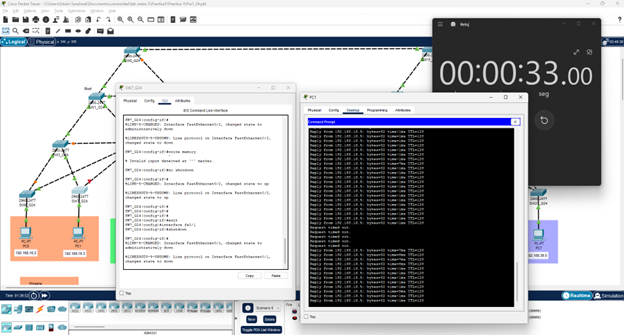

# Practica 1 - Grupo 24

## Integrantes: 
| Carnet    | Nombre                         |
| :-------- | :----------------------------- |
| 201431457 | Damihan Antonio Morales Cuyuch |
| 201314292 | Sergio Enrique Cubur Chalí     |
| 202010856 | Edwin Sandoval López           |


## Topología presentada

## VLANs

| ID| Nombre     | Vlan  | Máscara de subred | Gateway Predeterminado
|:------- | :------- | :-----: | :-----: | :-----: |
| 16| Primaria | Vlan 16 |255.255.255.0| 192.168.16.1| 
| 26| Básicos  | Vlan 26 |255.255.255.0| 192.168.26.1|
| 36| Básicos  | Vlan 36 |255.255.255.0| 192.168.36.1|

## Tabla de direccionamiento - Primera parte

<!--options-->
<table>

  <tr>
    <td align="center" nowrap="nowrap">Host</i></td>
    <td align="center" nowrap="nowrap">VLAN</td>
    <td align="center" nowrap="nowrap">Interfaz</td>
    <td align="center" nowrap="nowrap">Dirección IP</td>
    <td align="center" nowrap="nowrap">Máscara de Subred</td>
    <td align="center" nowrap="nowrap">Gateway Predeterminado</td>

  </tr>
  <tr>
    <td rowspan="3"><p>SW0_G24 </p>
    <td nowrap="nowrap"> Vlan 16</td>    
    <td nowrap="nowrap"> Fa0/1-3</td>    
    <td nowrap="nowrap"> No aplica</td>    
    <td nowrap="nowrap"> 255.255.255.0</td>    
    <td nowrap="nowrap"> 192.168.16.1</td>    
  </tr>
  <tr>
    <td nowrap="nowrap"> Vlan 26</td>    
    <td nowrap="nowrap"> Fa0/1-3</td>    
    <td nowrap="nowrap"> No aplica</td>    
    <td nowrap="nowrap"> 255.255.255.0</td>    
    <td nowrap="nowrap"> 192.168.26.1</td>    
  </tr>
  <tr>
    <td nowrap="nowrap"> Vlan 36</td>    
    <td nowrap="nowrap"> Fa0/1-3</td>    
    <td nowrap="nowrap"> No aplica</td>    
    <td nowrap="nowrap"> 255.255.255.0</td>    
    <td nowrap="nowrap"> 192.168.36.1</td>    
  </tr>

  <td rowspan="3"><p>SW1_G24 </p>
    <td nowrap="nowrap"> Vlan 16</td>    
    <td nowrap="nowrap"> Fa0/1-4</td>    
    <td nowrap="nowrap"> No aplica</td>    
    <td nowrap="nowrap"> 255.255.255.0</td>    
    <td nowrap="nowrap"> 192.168.16.1</td>    
  </tr>
  <tr>
    <td nowrap="nowrap"> Vlan 26</td>    
    <td nowrap="nowrap"> Fa0/1-4</td>    
    <td nowrap="nowrap"> No aplica</td>    
    <td nowrap="nowrap"> 255.255.255.0</td>    
    <td nowrap="nowrap"> 192.168.26.1</td>    
  </tr>
  <tr>
    <td nowrap="nowrap"> Vlan 36</td>    
    <td nowrap="nowrap"> Fa0/1-4</td>    
    <td nowrap="nowrap"> No aplica</td>    
    <td nowrap="nowrap"> 255.255.255.0</td>    
    <td nowrap="nowrap"> 192.168.36.1</td>    
  </tr>
  <td rowspan="3"><p>SW2_G24</p>
    <td nowrap="nowrap"> Vlan 16</td>    
    <td nowrap="nowrap"> Fa0/1-4</td>    
    <td nowrap="nowrap"> No aplica</td>    
    <td nowrap="nowrap"> 255.255.255.0</td>    
    <td nowrap="nowrap"> 192.168.16.1</td>    
  </tr>
  <tr>
    <td nowrap="nowrap"> Vlan 26</td>    
    <td nowrap="nowrap"> Fa0/1-4</td>    
    <td nowrap="nowrap"> No aplica</td>    
    <td nowrap="nowrap"> 255.255.255.0</td>    
    <td nowrap="nowrap"> 192.168.26.1</td>    
  </tr>
  <tr>
    <td nowrap="nowrap"> Vlan 36</td>    
    <td nowrap="nowrap"> Fa0/1-4</td>    
    <td nowrap="nowrap"> No aplica</td>    
    <td nowrap="nowrap"> 255.255.255.0</td>    
    <td nowrap="nowrap"> 192.168.36.1</td>    
  </tr>

  <td rowspan="3"><p>SW3_G24 </p>
    <td nowrap="nowrap"> Vlan 16</td>    
    <td nowrap="nowrap"> Fa0/1-4</td>    
    <td nowrap="nowrap"> No aplica</td>    
    <td nowrap="nowrap"> 255.255.255.0</td>    
    <td nowrap="nowrap"> 192.168.16.1</td>    
  </tr>
  <tr>
    <td nowrap="nowrap"> Vlan 26</td>    
    <td nowrap="nowrap"> Fa0/1-4</td>    
    <td nowrap="nowrap"> No aplica</td>    
    <td nowrap="nowrap"> 255.255.255.0</td>    
    <td nowrap="nowrap"> 192.168.26.1</td>    
  </tr>
  <tr>
    <td nowrap="nowrap"> Vlan 36</td>    
    <td nowrap="nowrap"> Fa0/1-4</td>    
    <td nowrap="nowrap"> No aplica</td>    
    <td nowrap="nowrap"> 255.255.255.0</td>    
    <td nowrap="nowrap"> 192.168.36.1</td>    
  </tr>

  <tr>
    <td rowspan="3"><p>SW4_G24 </p>
    <td nowrap="nowrap"> Vlan 16</td>    
    <td nowrap="nowrap"> Fa0/1-9</td>    
    <td nowrap="nowrap"> No aplica</td>    
    <td nowrap="nowrap"> 255.255.255.0</td>    
    <td nowrap="nowrap"> 192.168.16.1</td>    
  </tr>
  <tr>
    <td nowrap="nowrap"> Vlan 26</td>    
    <td nowrap="nowrap"> Fa0/1-9</td>    
    <td nowrap="nowrap"> No aplica</td>    
    <td nowrap="nowrap"> 255.255.255.0</td>    
    <td nowrap="nowrap"> 192.168.26.1</td>    
  </tr>
  <tr>
    <td nowrap="nowrap"> Vlan 36</td>    
    <td nowrap="nowrap"> Fa0/1-9</td>    
    <td nowrap="nowrap"> No aplica</td>    
    <td nowrap="nowrap"> 255.255.255.0</td>    
    <td nowrap="nowrap"> 192.168.36.1</td>    
  </tr>

 <tr>
    <td rowspan="3"><p>SW5_G24 </p>
    <td nowrap="nowrap"> Vlan 16</td>    
    <td nowrap="nowrap"> Fa0/1-4</td>    
    <td nowrap="nowrap"> No aplica</td>    
    <td nowrap="nowrap"> 255.255.255.0</td>    
    <td nowrap="nowrap"> 192.168.16.1</td>    
  </tr>
  <tr>
    <td nowrap="nowrap"> Vlan 26</td>    
    <td nowrap="nowrap"> Fa0/1-4</td>    
    <td nowrap="nowrap"> No aplica</td>    
    <td nowrap="nowrap"> 255.255.255.0</td>    
    <td nowrap="nowrap"> 192.168.26.1</td>    
  </tr>
  <tr>
    <td nowrap="nowrap"> Vlan 36</td>    
    <td nowrap="nowrap"> Fa0/1-4</td>    
    <td nowrap="nowrap"> No aplica</td>    
    <td nowrap="nowrap"> 255.255.255.0</td>    
    <td nowrap="nowrap"> 192.168.36.1</td>    
  </tr>

 <tr>
    <td rowspan="3"><p>SW6_G24</p>
    <td nowrap="nowrap"> Vlan 16</td>    
    <td nowrap="nowrap"> Fa0/3</td>    
    <td nowrap="nowrap"> No aplica</td>    
    <td nowrap="nowrap"> 255.255.255.0</td>    
    <td nowrap="nowrap"> 192.168.16.1</td>    
  </tr>
  <tr>
    <td nowrap="nowrap"> Vlan 26</td>    
    <td nowrap="nowrap"> Fa0/1-2</td>    
    <td nowrap="nowrap"> No aplica</td>    
    <td nowrap="nowrap"> 255.255.255.0</td>    
    <td nowrap="nowrap"> 192.168.26.1</td>    
  </tr>
  <tr>
    <td nowrap="nowrap"> Vlan 36</td>    
    <td nowrap="nowrap"> Fa0/1-2    </td>    
    <td nowrap="nowrap"> No aplica</td>    
    <td nowrap="nowrap"> 255.255.255.0</td>    
    <td nowrap="nowrap"> 192.168.36.1</td>    
  </tr>

<tr>
    <td rowspan="3"><p>SW7_G24</p>
    <td nowrap="nowrap"> Vlan 16</td>    
    <td nowrap="nowrap"> Fa0/3</td>    
    <td nowrap="nowrap"> No aplica</td>    
    <td nowrap="nowrap"> 255.255.255.0</td>    
    <td nowrap="nowrap"> 192.168.16.1</td>    
  </tr>
  <tr>
    <td nowrap="nowrap"> Vlan 26</td>    
    <td nowrap="nowrap"> Fa0/1-2</td>    
    <td nowrap="nowrap"> No aplica</td>    
    <td nowrap="nowrap"> 255.255.255.0</td>    
    <td nowrap="nowrap"> 192.168.26.1</td>    
  </tr>
  <tr>
    <td nowrap="nowrap"> Vlan 36</td>    
    <td nowrap="nowrap"> Fa0/1-2    </td>    
    <td nowrap="nowrap"> No aplica</td>    
    <td nowrap="nowrap"> 255.255.255.0</td>    
    <td nowrap="nowrap"> 192.168.36.1</td>    
  </tr>

<tr>
    <td rowspan="3"><p>SW8_G24</p>
    <td nowrap="nowrap"> Vlan 16</td>    
    <td nowrap="nowrap"> Fa0/1</td>    
    <td nowrap="nowrap"> No aplica</td>    
    <td nowrap="nowrap"> 255.255.255.0</td>    
    <td nowrap="nowrap"> 192.168.16.1</td>    
  </tr>
  <tr>
    <td nowrap="nowrap"> Vlan 26</td>    
    <td nowrap="nowrap"> Fa0/2</td>    
    <td nowrap="nowrap"> No aplica</td>    
    <td nowrap="nowrap"> 255.255.255.0</td>    
    <td nowrap="nowrap"> 192.168.26.1</td>    
  </tr>
  <tr>
    <td nowrap="nowrap"> Vlan 36</td>    
    <td nowrap="nowrap"> Fa0/1    </td>    
    <td nowrap="nowrap"> No aplica</td>    
    <td nowrap="nowrap"> 255.255.255.0</td>    
    <td nowrap="nowrap"> 192.168.36.1</td>    
  </tr>

  <tr>
    <td rowspan="3"><p>SW9_G24</p>
    <td nowrap="nowrap"> Vlan 16</td>    
    <td nowrap="nowrap"> Fa0/1-2</td>    
    <td nowrap="nowrap"> No aplica</td>    
    <td nowrap="nowrap"> 255.255.255.0</td>    
    <td nowrap="nowrap"> 192.168.16.1</td>    
  </tr>
  <tr>
    <td nowrap="nowrap"> Vlan 26</td>    
    <td nowrap="nowrap"> Fa0/1-2</td>    
    <td nowrap="nowrap"> No aplica</td>    
    <td nowrap="nowrap"> 255.255.255.0</td>    
    <td nowrap="nowrap"> 192.168.26.1</td>    
  </tr>
  <tr>
    <td nowrap="nowrap"> Vlan 36</td>    
    <td nowrap="nowrap"> Fa0/3    </td>    
    <td nowrap="nowrap"> No aplica</td>    
    <td nowrap="nowrap"> 255.255.255.0</td>    
    <td nowrap="nowrap"> 192.168.36.1</td>    
  </tr>

<tr>
    <td rowspan="3"><p>SW10_G24</p>
    <td nowrap="nowrap"> Vlan 16</td>    
    <td nowrap="nowrap"> Fa0/1-2</td>    
    <td nowrap="nowrap"> No aplica</td>    
    <td nowrap="nowrap"> 255.255.255.0</td>    
    <td nowrap="nowrap"> 192.168.16.1</td>    
  </tr>
  <tr>
    <td nowrap="nowrap"> Vlan 26</td>    
    <td nowrap="nowrap"> Fa0/1-2</td>    
    <td nowrap="nowrap"> No aplica</td>    
    <td nowrap="nowrap"> 255.255.255.0</td>    
    <td nowrap="nowrap"> 192.168.26.1</td>    
  </tr>
  <tr>
    <td nowrap="nowrap"> Vlan 36</td>    
    <td nowrap="nowrap"> Fa0/3    </td>    
    <td nowrap="nowrap"> No aplica</td>    
    <td nowrap="nowrap"> 255.255.255.0</td>    
    <td nowrap="nowrap"> 192.168.36.1</td>    
  </tr>

</table>
<!--/options-->


## Tabla de direccionamiento - Segunda Parte

<!--options-->
<table>

  <tr>
    <td align="center" nowrap="nowrap">Host</i></td>
    <td align="center" nowrap="nowrap">VLAN</td>
    <td align="center" nowrap="nowrap">Interfaz</td>
    <td align="center" nowrap="nowrap">Dirección IP</td>
    <td align="center" nowrap="nowrap">Máscara de Subred</td>
    <td align="center" nowrap="nowrap">Gateway Predeterminado</td>

  </tr>

  <tr>
    <td rowspan="3"><p>SW11_G24 </p>
    <td nowrap="nowrap"> Vlan 16</td>    
    <td nowrap="nowrap"> Fa0/1-3</td>    
    <td nowrap="nowrap"> No aplica</td>    
    <td nowrap="nowrap"> 255.255.255.0</td>    
    <td nowrap="nowrap"> 192.168.16.1</td>    
  </tr>
  <tr>
    <td nowrap="nowrap"> Vlan 26</td>    
    <td nowrap="nowrap"> Fa0/1-3</td>    
    <td nowrap="nowrap"> No aplica</td>    
    <td nowrap="nowrap"> 255.255.255.0</td>    
    <td nowrap="nowrap"> 192.168.26.1</td>    
  </tr>
  <tr>
    <td nowrap="nowrap"> Vlan 36</td>    
    <td nowrap="nowrap"> Fa0/1-3</td>    
    <td nowrap="nowrap"> No aplica</td>    
    <td nowrap="nowrap"> 255.255.255.0</td>    
    <td nowrap="nowrap"> 192.168.36.1</td>    
  </tr>

  <td rowspan="3"><p>SW12_G24 </p>
    <td nowrap="nowrap"> Vlan 16</td>    
    <td nowrap="nowrap"> Fa0/1-4</td>    
    <td nowrap="nowrap"> No aplica</td>    
    <td nowrap="nowrap"> 255.255.255.0</td>    
    <td nowrap="nowrap"> 192.168.16.1</td>    
  </tr>
  <tr>
    <td nowrap="nowrap"> Vlan 26</td>    
    <td nowrap="nowrap"> Fa0/1-4</td>    
    <td nowrap="nowrap"> No aplica</td>    
    <td nowrap="nowrap"> 255.255.255.0</td>    
    <td nowrap="nowrap"> 192.168.26.1</td>    
  </tr>
  <tr>
    <td nowrap="nowrap"> Vlan 36</td>    
    <td nowrap="nowrap"> Fa0/1-4</td>    
    <td nowrap="nowrap"> No aplica</td>    
    <td nowrap="nowrap"> 255.255.255.0</td>    
    <td nowrap="nowrap"> 192.168.36.1</td>    
  </tr>

  <td rowspan="3"><p>SW13_G24</p>
    <td nowrap="nowrap"> Vlan 16</td>    
    <td nowrap="nowrap"> Fa0/1-4</td>    
    <td nowrap="nowrap"> No aplica</td>    
    <td nowrap="nowrap"> 255.255.255.0</td>    
    <td nowrap="nowrap"> 192.168.16.1</td>    
  </tr>
  <tr>
    <td nowrap="nowrap"> Vlan 26</td>    
    <td nowrap="nowrap"> Fa0/1-4</td>    
    <td nowrap="nowrap"> No aplica</td>    
    <td nowrap="nowrap"> 255.255.255.0</td>    
    <td nowrap="nowrap"> 192.168.26.1</td>    
  </tr>
  <tr>
    <td nowrap="nowrap"> Vlan 36</td>    
    <td nowrap="nowrap"> Fa0/1-4</td>    
    <td nowrap="nowrap"> No aplica</td>    
    <td nowrap="nowrap"> 255.255.255.0</td>    
    <td nowrap="nowrap"> 192.168.36.1</td>    
  </tr>

  <td rowspan="3"><p>SW14_G24 </p>
    <td nowrap="nowrap"> Vlan 16</td>    
    <td nowrap="nowrap"> Fa0/1-4</td>    
    <td nowrap="nowrap"> No aplica</td>    
    <td nowrap="nowrap"> 255.255.255.0</td>    
    <td nowrap="nowrap"> 192.168.16.1</td>    
  </tr>
  <tr>
    <td nowrap="nowrap"> Vlan 26</td>    
    <td nowrap="nowrap"> Fa0/1-4</td>    
    <td nowrap="nowrap"> No aplica</td>    
    <td nowrap="nowrap"> 255.255.255.0</td>    
    <td nowrap="nowrap"> 192.168.26.1</td>    
  </tr>
  <tr>
    <td nowrap="nowrap"> Vlan 36</td>    
    <td nowrap="nowrap"> Fa0/1-4</td>    
    <td nowrap="nowrap"> No aplica</td>    
    <td nowrap="nowrap"> 255.255.255.0</td>    
    <td nowrap="nowrap"> 192.168.36.1</td>    
  </tr>

  <tr>
    <td rowspan="3"><p>SW15_G24 </p>
    <td nowrap="nowrap"> Vlan 16</td>    
    <td nowrap="nowrap"> Fa0/1-9</td>    
    <td nowrap="nowrap"> No aplica</td>    
    <td nowrap="nowrap"> 255.255.255.0</td>    
    <td nowrap="nowrap"> 192.168.16.1</td>    
  </tr>
  <tr>
    <td nowrap="nowrap"> Vlan 26</td>    
    <td nowrap="nowrap"> Fa0/1-9</td>    
    <td nowrap="nowrap"> No aplica</td>    
    <td nowrap="nowrap"> 255.255.255.0</td>    
    <td nowrap="nowrap"> 192.168.26.1</td>    
  </tr>
  <tr>
    <td nowrap="nowrap"> Vlan 36</td>    
    <td nowrap="nowrap"> Fa0/1-9</td>    
    <td nowrap="nowrap"> No aplica</td>    
    <td nowrap="nowrap"> 255.255.255.0</td>    
    <td nowrap="nowrap"> 192.168.36.1</td>    
  </tr>

 <tr>
    <td rowspan="3"><p>SW16_G24 </p>
    <td nowrap="nowrap"> Vlan 16</td>    
    <td nowrap="nowrap"> Fa0/1-4</td>    
    <td nowrap="nowrap"> No aplica</td>    
    <td nowrap="nowrap"> 255.255.255.0</td>    
    <td nowrap="nowrap"> 192.168.16.1</td>    
  </tr>
  <tr>
    <td nowrap="nowrap"> Vlan 26</td>    
    <td nowrap="nowrap"> Fa0/1-4</td>    
    <td nowrap="nowrap"> No aplica</td>    
    <td nowrap="nowrap"> 255.255.255.0</td>    
    <td nowrap="nowrap"> 192.168.26.1</td>    
  </tr>
  <tr>
    <td nowrap="nowrap"> Vlan 36</td>    
    <td nowrap="nowrap"> Fa0/1-4</td>    
    <td nowrap="nowrap"> No aplica</td>    
    <td nowrap="nowrap"> 255.255.255.0</td>    
    <td nowrap="nowrap"> 192.168.36.1</td>    
  </tr>

 <tr>
    <td rowspan="3"><p>SW17_G24</p>
    <td nowrap="nowrap"> Vlan 16</td>    
    <td nowrap="nowrap"> Fa0/3</td>    
    <td nowrap="nowrap"> No aplica</td>    
    <td nowrap="nowrap"> 255.255.255.0</td>    
    <td nowrap="nowrap"> 192.168.16.1</td>    
  </tr>
  <tr>
    <td nowrap="nowrap"> Vlan 26</td>    
    <td nowrap="nowrap"> Fa0/1-2</td>    
    <td nowrap="nowrap"> No aplica</td>    
    <td nowrap="nowrap"> 255.255.255.0</td>    
    <td nowrap="nowrap"> 192.168.26.1</td>    
  </tr>
  <tr>
    <td nowrap="nowrap"> Vlan 36</td>    
    <td nowrap="nowrap"> Fa0/1-2    </td>    
    <td nowrap="nowrap"> No aplica</td>    
    <td nowrap="nowrap"> 255.255.255.0</td>    
    <td nowrap="nowrap"> 192.168.36.1</td>    
  </tr>

<tr>
    <td rowspan="3"><p>SW18_G24</p>
    <td nowrap="nowrap"> Vlan 16</td>    
    <td nowrap="nowrap"> Fa0/3</td>    
    <td nowrap="nowrap"> No aplica</td>    
    <td nowrap="nowrap"> 255.255.255.0</td>    
    <td nowrap="nowrap"> 192.168.16.1</td>    
  </tr>
  <tr>
    <td nowrap="nowrap"> Vlan 26</td>    
    <td nowrap="nowrap"> Fa0/1-2</td>    
    <td nowrap="nowrap"> No aplica</td>    
    <td nowrap="nowrap"> 255.255.255.0</td>    
    <td nowrap="nowrap"> 192.168.26.1</td>    
  </tr>
  <tr>
    <td nowrap="nowrap"> Vlan 36</td>    
    <td nowrap="nowrap"> Fa0/1-2    </td>    
    <td nowrap="nowrap"> No aplica</td>    
    <td nowrap="nowrap"> 255.255.255.0</td>    
    <td nowrap="nowrap"> 192.168.36.1</td>    
  </tr>

<tr>
    <td rowspan="3"><p>SW19_G24</p>
    <td nowrap="nowrap"> Vlan 16</td>    
    <td nowrap="nowrap"> Fa0/1</td>    
    <td nowrap="nowrap"> No aplica</td>    
    <td nowrap="nowrap"> 255.255.255.0</td>    
    <td nowrap="nowrap"> 192.168.16.1</td>    
  </tr>
  <tr>
    <td nowrap="nowrap"> Vlan 26</td>    
    <td nowrap="nowrap"> Fa0/2</td>    
    <td nowrap="nowrap"> No aplica</td>    
    <td nowrap="nowrap"> 255.255.255.0</td>    
    <td nowrap="nowrap"> 192.168.26.1</td>    
  </tr>
  <tr>
    <td nowrap="nowrap"> Vlan 36</td>    
    <td nowrap="nowrap"> Fa0/1    </td>    
    <td nowrap="nowrap"> No aplica</td>    
    <td nowrap="nowrap"> 255.255.255.0</td>    
    <td nowrap="nowrap"> 192.168.36.1</td>    
  </tr>

  <tr>
    <td rowspan="3"><p>SW20_G24</p>
    <td nowrap="nowrap"> Vlan 16</td>    
    <td nowrap="nowrap"> Fa0/1-2</td>    
    <td nowrap="nowrap"> No aplica</td>    
    <td nowrap="nowrap"> 255.255.255.0</td>    
    <td nowrap="nowrap"> 192.168.16.1</td>    
  </tr>
  <tr>
    <td nowrap="nowrap"> Vlan 26</td>    
    <td nowrap="nowrap"> Fa0/1-2</td>    
    <td nowrap="nowrap"> No aplica</td>    
    <td nowrap="nowrap"> 255.255.255.0</td>    
    <td nowrap="nowrap"> 192.168.26.1</td>    
  </tr>
  <tr>
    <td nowrap="nowrap"> Vlan 36</td>    
    <td nowrap="nowrap"> Fa0/3    </td>    
    <td nowrap="nowrap"> No aplica</td>    
    <td nowrap="nowrap"> 255.255.255.0</td>    
    <td nowrap="nowrap"> 192.168.36.1</td>    
  </tr>

<tr>
    <td rowspan="3"><p>SW21_G24</p>
    <td nowrap="nowrap"> Vlan 16</td>    
    <td nowrap="nowrap"> Fa0/1-2</td>    
    <td nowrap="nowrap"> No aplica</td>    
    <td nowrap="nowrap"> 255.255.255.0</td>    
    <td nowrap="nowrap"> 192.168.16.1</td>    
  </tr>
  <tr>
    <td nowrap="nowrap"> Vlan 26</td>    
    <td nowrap="nowrap"> Fa0/1-2</td>    
    <td nowrap="nowrap"> No aplica</td>    
    <td nowrap="nowrap"> 255.255.255.0</td>    
    <td nowrap="nowrap"> 192.168.26.1</td>    
  </tr>
  <tr>
    <td nowrap="nowrap"> Vlan 36</td>    
    <td nowrap="nowrap"> Fa0/3    </td>    
    <td nowrap="nowrap"> No aplica</td>    
    <td nowrap="nowrap"> 255.255.255.0</td>    
    <td nowrap="nowrap"> 192.168.36.1</td>    
  </tr>

</table>


## Tabla de hosts

| Nombre  | MAC           | Vlan    | IP          | Gateway Predeterminado
| :-------| :-----:       |:-----: | :-----:      | :-----: |
| PC0     |0010.119A.B775 |Vlan 16  |192.168.16.2 | 192.168.16.1| 
| PC1     |00D0.FFEC.3C44 |Vlan 16  |192.168.16.3 | 192.168.16.1|
| Laptop0 |0050.0F5C.DE09 |Vlan 26  |192.168.26.2 | 192.168.26.1|
| PC2     |0002.17CB.DEC6 |Vlan 36  |192.168.36.2 | 192.168.36.1| 
| PC3     |0003.E4E8.DC0B |Vlan 36  |192.168.36.3 | 192.168.36.1|
| PC4     |0001.6320.E620 |Vlan 16  |192.168.16.4 | 192.168.16.1| 
| PC5     |0001.97A9.8E33 |Vlan 16  |192.168.16.5 | 192.168.16.1|
| Laptop1 |0000.0CA5.7B0D |Vlan 26  |192.168.26.3 | 192.168.26.1|
| PC6     |0009.7C22.C1E4 |Vlan 36  |192.168.36.4 | 192.168.36.1| 
| PC7     |0040.0B36.7305 |Vlan 36  |192.168.36.5 | 192.168.36.1|


## Configuración de Host

### PC0

### PC1

### Laptop0

### PC2

### PC3

### PC4

### PC5

### Laptop1

### PC6

### PC7


## Configuración de Switch

### SW0_G24

#### Cambio de hostname 
```bash 
Switch>enable 
Switch# configure terminal
Switch(config)# hostname SW0_G24
SW0_G24(config)# exit
SW0_G24# copy running-config startup-config
```
#### Configuración de VTP 
Cofiguración de switch como cliente
```bash
SW0_G24> enable
SW0_G24# configure terminal
SW0_G24(config)# vtp mode client 
SW0_G24(config)# vtp domain g24
SW0_G24(config)# vtp password redes2grupo24
SW0_G24(config)# do write
```

#### Configuración de enlaces troncales
```bash
SW0_G24> enable
SW0_G24# configure terminal
SW0_G24(config)# interface range  fa0/1 - 3
SW0_G24(config-if-range)# switchport mode trunk 
SW0_G24(config-if-range)# switchport nonegotiate 
SW0_G24(config-if-range)# switchport trunk allowed vlan all
SW0_G24(config-if-range)# exit
SW0_G24(config)# do write
```

### SW1_G24

#### Cambio de hostname 
```bash 
Switch>enable 
Switch# configure terminal
Switch(config)# hostname SW1_G24
SW1_G24(config)# exit
SW1_G24# copy running-config startup-config
```
#### Configuración de VTP 
Cofiguración de switch como cliente
```bash
SW1_G24> enable
SW1_G24# configure terminal
SW1_G24(config)# vtp mode client 
SW1_G24(config)# vtp domain g24
SW1_G24(config)# vtp password redes2grupo24
SW1_G24(config)# do write
```

#### Configuración de enlaces troncales
```bash
SW1_G24> enable
SW1_G24# configure terminal
SW1_G24(config)# interface range  fa0/1 - 4
SW1_G24(config-if-range)# switchport mode trunk 
SW1_G24(config-if-range)# switchport nonegotiate 
SW1_G24(config-if-range)# switchport trunk allowed vlan all
SW1_G24(config-if-range)# exit
SW1_G24(config)# do write
```


### SW2_G24

#### Cambio de hostname 
```bash 
Switch>enable 
Switch# configure terminal
Switch(config)# hostname SW2_G24
SW2_G24(config)# exit
SW2_G24# copy running-config startup-config
```

#### Configuración de VTP 
Cofiguración de switch como cliente
```bash
SW2_G24> enable
SW2_G24# configure terminal
SW2_G24(config)# vtp mode client 
SW2_G24(config)# vtp domain g24
SW2_G24(config)# vtp password redes2grupo24
SW2_G24(config)# do write
```
#### Configuración de enlaces troncales
```bash
SW2_G24> enable
SW2_G24# configure terminal
SW2_G24(config)# interface range  fa0/1 - 4
SW2_G24(config-if-range)# switchport mode trunk 
SW2_G24(config-if-range)# switchport nonegotiate 
SW2_G24(config-if-range)# switchport trunk allowed vlan all
SW2_G24(config-if-range)# exit
SW2_G24(config)# do write
```


### SW3_G24

#### Cambio de hostname 
```bash 
Switch>enable 
Switch# configure terminal
Switch(config)# hostname SW3_G24
SW3_G24(config)# exit
SW3_G24# copy running-config startup-config
```
#### Configuración de VTP 
Cofiguración de switch como cliente
```bash
SW3_G24> enable
SW3_G24# configure terminal
SW3_G24(config)# vtp mode client 
SW3_G24(config)# vtp domain g24
SW3_G24(config)# vtp password redes2grupo24
SW3_G24(config)# do write
```
#### Configuración de enlaces troncales
```bash
SW3_G24> enable
SW3_G24# configure terminal
SW3_G24(config)# interface range  fa0/1 - 4
SW3_G24(config-if-range)# switchport mode trunk 
SW3_G24(config-if-range)# switchport nonegotiate 
SW3_G24(config-if-range)# switchport trunk allowed vlan all
SW3_G24(config-if-range)# exit
SW3_G24(config)# do write
```


### SW4_G24 (raiz 1)

## Aseguramiento 

#### Cambio de hostname 
```bash 
Switch>enable 
Switch# configure terminal
Switch(config)# hostname SW4_G24
SW4_G24(config)# exit
SW4_G24# copy running-config startup-config
```
### Aseguramiento del switch

```bash 
Switch>enable 
Switch# configure terminal
Switch(config)# enable secret redes2grupo24
SW4_G24(config)# exit
SW4_G24# copy running-config startup-config
```

#### Configuración de VTP (server/raiz)
Configuración de switch en modo server
```bash
SW4_G24> enable
SW4_G24# configure terminal
SW4_G24(config)# vtp mode server
SW4_G24(config)# vtp version 2
SW4_G24(config)# vtp domain g24
SW4_G24(config)# vtp password redes2grupo24
SW4_G24(config)# do write
```
#### Creación de Vlan's 
Las Vlans se pueden crear en un solo server, no es necesario crearlas en el 2do server
```bash
SW4_G24> enable 
SW4_G24# configure terminal 
SW4_G24(config)# vlan  16
SW4_G24(config-vlan)# name Primaria
SW4_G24(config-vlan)# exit
SW4_G24(config)# vlan 26 
SW4_G24(config-vlan)# name Basicos
SW4_G24(config-vlan)# exit
SW4_G24(config)# vlan 36
SW4_G24(config-vlan)# name Diversificado
SW4_G24(config-vlan)# exit
SW4_G24(config)# do write

```

#### Configuración de enlaces troncales
```bash
SW4_G24> enable
SW4_G24# configure terminal
SW4_G24(config)# interface range  fa0/1 - 9
SW4_G24(config-if-range)# switchport mode trunk 
SW4_G24(config-if-range)# switchport nonegotiate 
SW4_G24(config-if-range)# switchport trunk allowed vlan all
SW4_G24(config-if-range)# exit
SW4_G24(config)# do write
```


### SW5_G24

#### Cambio de hostname 
```bash 
Switch>enable 
Switch# configure terminal
Switch(config)# hostname SW5_G24
SW5_G24(config)# exit
SW5_G24# copy running-config startup-config
```
#### Configuración de VTP 
Cofiguración de switch como cliente
```bash
SW5_G24> enable
SW5_G24# configure terminal
SW5_G24(config)# vtp mode client 
SW5_G24(config)# vtp domain g24
SW5_G24(config)# vtp password redes2grupo24
SW5_G24(config)# do write
```
#### Configuración de enlaces troncales
```bash
SW5_G24> enable
SW5_G24# configure terminal
SW5_G24(config)# interface range  fa0/1 - 4
SW5_G24(config-if-range)# switchport mode trunk 
SW5_G24(config-if-range)# switchport nonegotiate 
SW5_G24(config-if-range)# switchport trunk allowed vlan all
SW5_G24(config-if-range)# exit
SW5_G24(config)# do write
```

### SW6_G24

#### Cambio de hostname 
```bash 
Switch>enable 
Switch# configure terminal
Switch(config)# hostname SW6_G24
SW6_G24(config)# exit
SW6_G24# copy running-config startup-config
```
#### Configuración de VTP 
Cofiguración de switch como cliente
```bash
SW6_G24> enable
SW6_G24# configure terminal
SW6_G24(config)# vtp mode client 
SW6_G24(config)# vtp domain g24
SW6_G24(config)# vtp password redes2grupo24
SW6_G24(config)# do write
```
#### Configuración de enlaces troncales
```bash
SW6_G24> enable
SW6_G24# configure terminal
SW6_G24(config)# interface range  fa0/1 - 2
SW6_G24(config-if-range)# switchport mode trunk 
SW6_G24(config-if-range)# switchport nonegotiate 
SW6_G24(config-if-range)# switchport trunk allowed vlan all
SW6_G24(config-if-range)# exit
SW6_G24(config)# do write
```

#### Configuración de puertos de acceso
```bash
SW6_G24> enable
SW6_G24# configure terminal
SW6_G24(config)# interface fa0/3
SW6_G24(config-if)# switchport mode access
SW6_G24(config-if)# switchport access vlan 16
SW6_G24(config-if)# exit
SW6_G24(config)# do write
```

#### Configuracion de Port Security
```bash
SW6_G24> enable
SW6_G24# configure terminal
SW6_G24(config)# interface fa0/3
SW6_G24(config-if)# switchport port-security
SW6_G24(config-if)# switchport port-security mac-address 0010.119A.B775
SW6_G24(config-if)# exit
SW6_G24(config)# do write
```


### SW7_G24

#### Cambio de hostname 
```bash 
Switch>enable 
Switch# configure terminal
Switch(config)# hostname SW7_G24
SW7_G24(config)# exit
SW7_G24# copy running-config startup-config
```
#### Configuración de VTP 
Cofiguración de switch como cliente
```bash
SW7_G24> enable
SW7_G24# configure terminal
SW7_G24(config)# vtp mode client 
SW7_G24(config)# vtp domain g24
SW7_G24(config)# vtp password redes2grupo24
SW7_G24(config)# do write
```
#### Configuración de enlaces troncales
```bash
SW7_G24> enable
SW7_G24# configure terminal
SW7_G24(config)# interface range  fa0/1 - 2
SW7_G24(config-if-range)# switchport mode trunk 
SW7_G24(config-if-range)# switchport nonegotiate 
SW7_G24(config-if-range)# switchport trunk allowed vlan all
SW7_G24(config-if-range)# exit
SW7_G24(config)# do write
```
#### Configuración de puertos de acceso
```bash
SW7_G24> enable
SW7_G24# configure terminal
SW7_G24(config)# interface fa0/3
SW7_G24(config-if)# switchport mode access
SW7_G24(config-if)# switchport access vlan 16
SW7_G24(config-if)# exit
SW7_G24(config)# do write
```

#### Configuracion de Port Security
```bash
SW7_G24> enable
SW7_G24# configure terminal
SW7_G24(config)# interface fa0/3
SW7_G24(config-if)# switchport port-security
SW7_G24(config-if)# switchport port-security mac-address 00D0.FFEC.3C44
SW7_G24(config-if)# exit
SW7_G24(config)# do write
```

### SW8_G24

#### Cambio de hostname 
```bash 
Switch>enable 
Switch# configure terminal
Switch(config)# hostname SW8_G24
SW8_G24(config)# exit
SW8_G24# copy running-config startup-config
```

#### Configuración de VTP 
Cofiguración de switch como cliente
```bash
SW8_G24> enable
SW8_G24# configure terminal
SW8_G24(config)# vtp mode client 
SW8_G24(config)# vtp domain g24
SW8_G24(config)# vtp password redes2grupo24
SW8_G24(config)# do write
```
#### Configuración de enlaces troncales
```bash
SW8_G24> enable
SW8_G24# configure terminal
SW8_G24(config)# interface  fa0/1 
SW8_G24(config-if)# switchport mode trunk 
SW8_G24(config-if)# switchport nonegotiate 
SW8_G24(config-if)# switchport trunk allowed vlan all
SW8_G24(config-if)# exit
SW8_G24(config)# do write
```

#### Configuración de puertos de acceso
```bash
SW8_G24> enable
SW8_G24# configure terminal
SW8_G24(config)# interface fa0/2
SW8_G24(config-if)# switchport mode access
SW8_G24(config-if)# switchport access vlan 26
SW8_G24(config-if)# exit
SW8_G24(config)# do write
```
#### Configuracion de Port Security
```bash
SW8_G24> enable
SW8_G24# configure terminal
SW8_G24(config)# interface fa0/2
SW8_G24(config-if)# switchport port-security
SW8_G24(config-if)# switchport port-security mac-address 0050.0F5C.DE09
SW8_G24(config-if)# exit
SW8_G24(config)# do write
```


### SW9_G24

#### Cambio de hostname 
```bash 
Switch>enable 
Switch# configure terminal
Switch(config)# hostname SW9_G24
SW9_G24(config)# exit
SW9_G24# copy running-config startup-config
```
#### Configuración de VTP 
Cofiguración de switch como cliente
```bash
SW9_G24> enable
SW9_G24# configure terminal
SW9_G24(config)# vtp mode client 
SW9_G24(config)# vtp domain g24
SW9_G24(config)# vtp password redes2grupo24
SW9_G24(config)# do write
```
#### Configuración de enlaces troncales
```bash
SW9_G24> enable
SW9_G24# configure terminal
SW9_G24(config)# interface range  fa0/1 - 2
SW9_G24(config-if-range)# switchport mode trunk 
SW9_G24(config-if-range)# switchport nonegotiate 
SW9_G24(config-if-range)# switchport trunk allowed vlan all
SW9_G24(config-if-range)# exit
SW9_G24(config)# do write
```
#### Configuración de puertos de acceso
```bash
SW9_G24> enable
SW9_G24# configure terminal
SW9_G24(config)# interface fa0/3
SW9_G24(config-if)# switchport mode access
SW9_G24(config-if)# switchport access vlan 36
SW9_G24(config-if)# exit
SW9_G24(config)# do write
```
#### Configuracion de Port Security
```bash
SW9_G24> enable
SW9_G24# configure terminal
SW9_G24(config)# interface fa0/3
SW9_G24(config-if)# switchport port-security
SW9_G24(config-if)# switchport port-security mac-address 0002.17CB.DEC6
SW9_G24(config-if)# exit
SW9_G24(config)# do write
```


### SW10_G24

#### Cambio de hostname 
```bash 
Switch>enable 
Switch# configure terminal
Switch(config)# hostname SW10_G24
SW10_G24(config)# exit
SW10_G24# copy running-config startup-config
```
#### Configuración de VTP 
Cofiguración de switch como cliente
```bash
SW10_G24> enable
SW10_G24# configure terminal
SW10_G24(config)# vtp mode client 
SW10_G24(config)# vtp domain g24
SW10_G24(config)# vtp password redes2grupo24
SW10_G24(config)# do write
```
#### Configuración de enlaces troncales
```bash
SW10_G24> enable
SW10_G24# configure terminal
SW10_G24(config)# interface range  fa0/1 - 2
SW10_G24(config-if-range)# switchport mode trunk 
SW10_G24(config-if-range)# switchport nonegotiate 
SW10_G24(config-if-range)# switchport trunk allowed vlan all
SW10_G24(config-if-range)# exit
SW10_G24(config)# do write
```
#### Configuración de puertos de acceso
```bash
SW10_G24> enable
SW10_G24# configure terminal
SW10_G24(config)# interface fa0/3
SW10_G24(config-if)# switchport mode access
SW10_G24(config-if)# switchport access vlan 36
SW10_G24(config-if)# exit
SW10_G24(config)# do write
```

#### Configuracion de Port Security
```bash
SW10_G24> enable
SW10_G24# configure terminal
SW10_G24(config)# interface fa0/3
SW10_G24(config-if)# switchport port-security
SW10_G24(config-if)# switchport port-security mac-address 0003.E4E8.DC0B
SW10_G24(config-if)# exit
SW10_G24(config)# do write
```

### SW11_G24

#### Cambio de hostname 
```bash 
Switch>enable 
Switch# configure terminal
Switch(config)# hostname SW11_G24
SW11_G24(config)# exit
SW11_G24# copy running-config startup-config
```

#### Configuración de VTP 
Cofiguración de switch como cliente
```bash
SW11_G24> enable
SW11_G24# configure terminal
SW11_G24(config)# vtp mode client 
SW11_G24(config)# vtp domain g24
SW11_G24(config)# vtp password redes2grupo24
SW11_G24(config)# do write
```

#### Configuración de enlaces troncales
```bash
SW11_G24> enable
SW11_G24# configure terminal
SW11_G24(config)# interface range  fa0/1 - 3
SW11_G24(config-if-range)# switchport mode trunk 
SW11_G24(config-if-range)# switchport nonegotiate 
SW11_G24(config-if-range)# switchport trunk allowed vlan all
SW11_G24(config-if-range)# exit
SW11_G24(config)# do write
```


### SW12_G24

#### Cambio de hostname 
```bash 
Switch>enable 
Switch# configure terminal
Switch(config)# hostname SW12_G24
SW12_G24(config)# exit
SW12_G24# copy running-config startup-config
```

#### Configuración de VTP 
Cofiguración de switch como cliente
```bash
SW12_G24> enable
SW12_G24# configure terminal
SW12_G24(config)# vtp mode client 
SW12_G24(config)# vtp domain g24
SW12_G24(config)# vtp password redes2grupo24
SW12_G24(config)# do write
```

#### Configuración de enlaces troncales
```bash
SW12_G24> enable
SW12_G24# configure terminal
SW12_G24(config)# interface range  fa0/1 - 4
SW12_G24(config-if-range)# switchport mode trunk 
SW12_G24(config-if-range)# switchport nonegotiate 
SW12_G24(config-if-range)# switchport trunk allowed vlan all
SW12_G24(config-if-range)# exit
SW12_G24(config)# do write
```


### SW13_G24

#### Cambio de hostname 
```bash 
Switch>enable 
Switch# configure terminal
Switch(config)# hostname SW13_G24
SW13_G24(config)# exit
SW13_G24# copy running-config startup-config
```
#### Configuración de VTP 
Cofiguración de switch como cliente
```bash
SW13_G24> enable
SW13_G24# configure terminal
SW13_G24(config)# vtp mode client 
SW13_G24(config)# vtp domain g24
SW13_G24(config)# vtp password redes2grupo24
SW13_G24(config)# do write
```

#### Configuración de enlaces troncales
```bash
SW13_G24> enable
SW13_G24# configure terminal
SW13_G24(config)# interface range  fa0/1 - 4
SW13_G24(config-if-range)# switchport mode trunk 
SW13_G24(config-if-range)# switchport nonegotiate 
SW13_G24(config-if-range)# switchport trunk allowed vlan all
SW13_G24(config-if-range)# exit
SW13_G24(config)# do write
```


### SW14_G24

#### Cambio de hostname 
```bash 
Switch>enable 
Switch# configure terminal
Switch(config)# hostname SW14_G24
SW14_G24(config)# exit
SW14_G24# copy running-config startup-config
```
#### Configuración de VTP 
Cofiguración de switch como cliente
```bash
SW14_G24> enable
SW14_G24# configure terminal
SW14_G24(config)# vtp mode client 
SW14_G24(config)# vtp domain g24
SW14_G24(config)# vtp password redes2grupo24
SW14_G24(config)# do write
```

#### Configuración de enlaces troncales
```bash
SW14_G24> enable
SW14_G24# configure terminal
SW14_G24(config)# interface range  fa0/1 - 4
SW14_G24(config-if-range)# switchport mode trunk 
SW14_G24(config-if-range)# switchport nonegotiate 
SW14_G24(config-if-range)# switchport trunk allowed vlan all
SW14_G24(config-if-range)# exit
SW14_G24(config)# do write
```

### SW115_G24 (raiz 2)

#### Cambio de hostname 
```bash 
Switch>enable 
Switch# configure terminal
Switch(config)# hostname SW15_G24
SW15_G24(config)# exit
SW15_G24# copy running-config startup-config
```
### Aseguramiento del switch

```bash 
Switch>enable 
Switch# configure terminal
Switch(config)# enable secret redes2grupo24
SW15_G24(config)# exit
SW15_G24# copy running-config startup-config
```

#### Configuración de VTP (server/raiz)

```bash 
SW15_G24> enable
SW15_G24# configure terminal
SW15_G24(config)# vtp mode server
SW15_G24(config)# vtp version 2
SW15_G24(config)# vtp domain g24
SW15_G24(config)# vtp password redes2grupo24
SW15_G24(config)# do write
```

#### Configuración de enlaces troncales
```bash
SW15_G24> enable
SW15_G24# configure terminal
SW15_G24(config)# interface range  fa0/1 - 9
SW15_G24(config-if-range)# switchport mode trunk 
SW15_G24(config-if-range)# switchport nonegotiate 
SW15_G24(config-if-range)# switchport trunk allowed vlan all
SW15_G24(config-if-range)# exit
SW15_G24(config)# do write
```


### SW16_G24

#### Cambio de hostname 
```bash 
Switch>enable 
Switch# configure terminal
Switch(config)# hostname SW16_G24
SW16_G24(config)# exit
SW16_G24# copy running-config startup-config
```
#### Configuración de VTP 
Cofiguración de switch como cliente
```bash
SW16_G24> enable
SW16_G24# configure terminal
SW16_G24(config)# vtp mode client 
SW16_G24(config)# vtp domain g24
SW16_G24(config)# vtp password redes2grupo24
SW16_G24(config)# do write
```

#### Configuración de enlaces troncales
```bash
SW16_G24> enable
SW16_G24# configure terminal
SW16_G24(config)# interface range  fa0/1 - 4
SW16_G24(config-if-range)# switchport mode trunk 
SW16_G24(config-if-range)# switchport nonegotiate 
SW16_G24(config-if-range)# switchport trunk allowed vlan all
SW16_G24(config-if-range)# exit
SW16_G24(config)# do write
```

### SW17_G24

#### Cambio de hostname 
```bash 
Switch>enable 
Switch# configure terminal
Switch(config)# hostname SW17_G24
SW17_G24(config)# exit
SW17_G24# copy running-config startup-config
```
#### Configuración de VTP 
Cofiguración de switch como cliente
```bash
SW17_G24> enable
SW17_G24# configure terminal
SW17_G24(config)# vtp mode client 
SW17_G24(config)# vtp domain g24
SW17_G24(config)# vtp password redes2grupo24
SW17_G24(config)# do write
```
#### Configuración de enlaces troncales
```bash
SW17_G24> enable
SW17_G24# configure terminal
SW17_G24(config)# interface range  fa0/1 - 2
SW17_G24(config-if-range)# switchport mode trunk 
SW17_G24(config-if-range)# switchport nonegotiate 
SW17_G24(config-if-range)# switchport trunk allowed vlan all
SW17_G24(config-if-range)# exit
SW17_G24(config)# do write
```
#### Configuración de puertos de acceso
```bash
SW17_G24> enable
SW17_G24# configure terminal
SW17_G24(config)# interface fa0/3
SW17_G24(config-if)# switchport mode access
SW17_G24(config-if)# switchport access vlan 16
SW17_G24(config-if)# exit
SW17_G24(config)# do write
```
#### Configuracion de Port Security
```bash
SW17_G24> enable
SW17_G24# configure terminal
SW17_G24(config)# interface fa0/3
SW17_G24(config-if)# switchport port-security
SW17_G24(config-if)# switchport port-security mac-address 0001.6320.E620
SW17_G24(config-if)# exit
SW17_G24(config)# do write
```


### SW18_G24

#### Cambio de hostname 
```bash 
Switch>enable 
Switch# configure terminal
Switch(config)# hostname SW18_G24
SW18_G24(config)# exit
SW18_G24# copy running-config startup-config
```

#### Configuración de VTP 
Cofiguración de switch como cliente
```bash
SW18_G24> enable
SW18_G24# configure terminal
SW18_G24(config)# vtp mode client 
SW18_G24(config)# vtp domain g24
SW18_G24(config)# vtp password redes2grupo24
SW18_G24(config)# do write
```
#### Configuración de enlaces troncales
```bash
SW18_G24> enable
SW18_G24# configure terminal
SW18_G24(config)# interface range  fa0/1 - 2
SW18_G24(config-if-range)# switchport mode trunk 
SW18_G24(config-if-range)# switchport nonegotiate 
SW18_G24(config-if-range)# switchport trunk allowed vlan all
SW18_G24(config-if-range)# exit
SW18_G24(config)# do write
```
#### Configuración de puertos de acceso
```bash
SW18_G24> enable
SW18_G24# configure terminal
SW18_G24(config)# interface fa0/3
SW18_G24(config-if)# switchport mode access
SW18_G24(config-if)# switchport access vlan 16
SW18_G24(config-if)# exit
SW18_G24(config)# do write
```
#### Configuracion de Port Security
```bash
SW18_G24> enable
SW18_G24# configure terminal
SW18_G24(config)# interface fa0/3
SW18_G24(config-if)# switchport port-security
SW18_G24(config-if)# switchport port-security mac-address 0001.97A9.8E33
SW18_G24(config-if)# exit
SW18_G24(config)# do write
```


### SW19_G24

#### Cambio de hostname 
```bash 
Switch>enable 
Switch# configure terminal
Switch(config)# hostname SW19_G24
SW19_G24(config)# exit
SW19_G24# copy running-config startup-config
```

#### Configuración de VTP 
Cofiguración de switch como cliente
```bash
SW19_G24> enable
SW19_G24# configure terminal
SW19_G24(config)# vtp mode client 
SW19_G24(config)# vtp domain g24
SW19_G24(config)# vtp password redes2grupo24
SW19_G24(config)# do write
```
#### Configuración de enlaces troncales
```bash
SW19_G24> enable
SW19_G24# configure terminal
SW19_G24(config)# interface  fa0/1 
SW19_G24(config-if)# switchport mode trunk 
SW19_G24(config-if)# switchport nonegotiate 
SW19_G24(config-if)# switchport trunk allowed vlan all
SW19_G24(config-if)# exit
SW19_G24(config)# do write
```
#### Configuración de puertos de acceso
```bash
SW19_G24> enable
SW19_G24# configure terminal
SW19_G24(config)# interface fa0/2
SW19_G24(config-if)# switchport mode access
SW19_G24(config-if)# switchport access vlan 26
SW19_G24(config-if)# exit
SW19_G24(config)# do write
```
#### Configuracion de Port Security
```bash
SW19_G24> enable
SW19_G24# configure terminal
SW19_G24(config)# interface fa0/2
SW19_G24(config-if)# switchport port-security
SW19_G24(config-if)# switchport port-security mac-address 0000.0CA5.7B0D
SW19_G24(config-if)# exit
SW19_G24(config)# do write
```

### SW20_G24

#### Cambio de hostname 
```bash 
Switch>enable 
Switch# configure terminal
Switch(config)# hostname SW20_G24
SW20_G24(config)# exit
SW20_G24# copy running-config startup-config
```
#### Configuración de VTP 
```bash
SW20_G24> enable
SW20_G24# configure terminal
SW20_G24(config)# vtp mode client 
SW20_G24(config)# vtp domain g24
SW20_G24(config)# vtp password redes2grupo24
SW20_G24(config)# do write
```
#### Configuración de enlaces troncales
```bash
SW20_G24> enable
SW20_G24# configure terminal
SW20_G24(config)# interface range  fa0/1 - 2
SW20_G24(config-if-range)# switchport mode trunk 
SW20_G24(config-if-range)# switchport nonegotiate 
SW20_G24(config-if-range)# switchport trunk allowed vlan all
SW20_G24(config-if-range)# exit
SW20_G24(config)# do write
```
#### Configuración de puertos de acceso
```bash
SW20_G24> enable
SW20_G24# configure terminal
SW20_G24(config)# interface fa0/3
SW20_G24(config-if)# switchport mode access
SW20_G24(config-if)# switchport access vlan 36
SW20_G24(config-if)# exit
SW20_G24(config)# do write
```
#### Configuracion de Port Security
```bash
SW20_G24> enable
SW20_G24# configure terminal
SW20_G24(config)# interface fa0/3
SW20_G24(config-if)# switchport port-security
SW20_G24(config-if)# switchport port-security mac-address 0009.7C22.C1E4
SW20_G24(config-if)# exit
SW20_G24(config)# do write
```
### SW21_G24

#### Cambio de hostname 
```bash 
Switch>enable 
Switch# configure terminal
Switch(config)# hostname SW21_G24
SW21_G24(config)# exit
SW21_G24# copy running-config startup-config
```
#### Configuración de VTP 
```bash
SW21_G24> enable
SW21_G24# configure terminal
SW21_G24(config)# vtp mode client 
SW21_G24(config)# vtp domain g24
SW21_G24(config)# vtp password redes2grupo24
SW21_G24(config)# do write
```

#### Configuración de enlaces troncales
```bash
SW21_G24> enable
SW21_G24# configure terminal
SW21_G24(config)# interface range  fa0/1 - 2
SW21_G24(config-if-range)# switchport mode trunk 
SW21_G24(config-if-range)# switchport nonegotiate 
SW21_G24(config-if-range)# switchport trunk allowed vlan all
SW21_G24(config-if-range)# exit
SW21_G24(config)# do write
```

#### Configuración de puertos de acceso
```bash
SW21_G24> enable
SW21_G24# configure terminal
SW21_G24(config)# interface fa0/3
SW21_G24(config-if)# switchport mode access
SW21_G24(config-if)# switchport access vlan 36
SW21_G24(config-if)# exit
SW21_G24(config)# do write
```

#### Configuracion de Port Security
```bash
SW20_G24> enable
SW20_G24# configure terminal
SW20_G24(config)# interface fa0/3
SW20_G24(config-if)# switchport port-security
SW20_G24(config-if)# switchport port-security mac-address 0040.0B36.7305
SW20_G24(config-if)# exit
SW20_G24(config)# do write
```
## Configuración de STP
### PVST por defecto.
### Configuración de Rapid PVST
### SW1_G4
```bash
SW1_G24> enable
SW1_G24# configure terminal
SW1_G24(config)# spanning-tree mode rapid-pvst
SW1_G24(config)# end
SW1_G24# copy running-config startup-config
```

### SW2_G4
```bash
SW2_G24> enable
SW2_G24# configure terminal
SW2_G24(config)# spanning-tree mode rapid-pvst
SW2_G24(config)# end
SW2_G24# copy running-config startup-config
```

### SW3_G4
```bash
SW3_G24> enable
SW3_G24# configure terminal
SW3_G24(config)# spanning-tree mode rapid-pvst
SW3_G24(config)# end
SW3_G24# copy running-config startup-config
```

### SW4_G4
```bash
SW4_G24> enable
SW4_G24# configure terminal
SW4_G24(config)# spanning-tree mode rapid-pvst
SW4_G24(config)# end
SW4_G24# copy running-config startup-config
```

### SW5_G4
```bash
SW5_G24> enable
SW5_G24# configure terminal
SW5_G24(config)# spanning-tree mode rapid-pvst
SW5_G24(config)# end
SW5_G24# copy running-config startup-config
```

### SW6_G4
```bash
SW6_G24> enable
SW6_G24# configure terminal
SW6_G24(config)# spanning-tree mode rapid-pvst
SW6_G24(config)# end
SW6_G24# copy running-config startup-config
```

### SW7_G4
```bash
SW7_G24> enable
SW7_G24# configure terminal
SW7_G24(config)# spanning-tree mode rapid-pvst
SW7_G24(config)# end
SW7_G24# copy running-config startup-config
```

### SW8_G4
```bash
SW8_G24> enable
SW8_G24# configure terminal
SW8_G24(config)# spanning-tree mode rapid-pvst
SW8_G24(config)# end
SW8_G24# copy running-config startup-config
```

### SW9_G4
```bash
SW9_G24> enable
SW9_G24# configure terminal
SW9_G24(config)# spanning-tree mode rapid-pvst
SW9_G24(config)# end
SW9_G24# copy running-config startup-config
```

### SW10_G4
```bash
SW10_G24> enable
SW10_G24# configure terminal
SW10_G24(config)# spanning-tree mode rapid-pvst
SW10_G24(config)# end
SW10_G24# copy running-config startup-config
```

### SW11_G4
```bash
SW11_G24> enable
SW11_G24# configure terminal
SW11_G24(config)# spanning-tree mode rapid-pvst
SW11_G24(config)# end
SW11_G24# copy running-config startup-config
```

### SW12_G4
```bash
SW12_G24> enable
SW12_G24# configure terminal
SW12_G24(config)# spanning-tree mode rapid-pvst
SW12_G24(config)# end
SW12_G24# copy running-config startup-config
```

### SW13_G4
```bash
SW13_G24> enable
SW13_G24# configure terminal
SW13_G24(config)# spanning-tree mode rapid-pvst
SW13_G24(config)# end
SW13_G24# copy running-config startup-config
```

### SW14_G4
```bash
SW14_G24> enable
SW14_G24# configure terminal
SW14_G24(config)# spanning-tree mode rapid-pvst
SW14_G24(config)# end
SW14_G24# copy running-config startup-config
```

### SW15_G4
```bash
SW15_G24> enable
SW15_G24# configure terminal
SW15_G24(config)# spanning-tree mode rapid-pvst
SW15_G24(config)# end
SW15_G24# copy running-config startup-config
```

### SW16_G4
```bash
SW16_G24> enable
SW16_G24# configure terminal
SW16_G24(config)# spanning-tree mode rapid-pvst
SW16_G24(config)# end
SW16_G24# copy running-config startup-config
```

### SW17_G4
```bash
SW17_G24> enable
SW17_G24# configure terminal
SW17_G24(config)# spanning-tree mode rapid-pvst
SW17_G24(config)# end
SW17_G24# copy running-config startup-config
```

### SW18_G4
```bash
SW18_G24> enable
SW18_G24# configure terminal
SW18_G24(config)# spanning-tree mode rapid-pvst
SW18_G24(config)# end
SW18_G24# copy running-config startup-config
```

### SW19_G4
```bash
SW19_G24> enable
SW19_G24# configure terminal
SW19_G24(config)# spanning-tree mode rapid-pvst
SW19_G24(config)# end
SW19_G24# copy running-config startup-config
```

### SW20_G4
```bash
SW20_G24> enable
SW20_G24# configure terminal
SW20_G24(config)# spanning-tree mode rapid-pvst
SW20_G24(config)# end
SW20_G24# copy running-config startup-config
```

### SW21_G4
```bash
SW21_G24> enable
SW21_G24# configure terminal
SW21_G24(config)# spanning-tree mode rapid-pvst
SW21_G24(config)# end
SW21_G24# copy running-config startup-config
```

## Convergencia PVST vrs RPVST
| Escenario     | Protocolo STP  | Primaria | Básicos | Diversificado
|:------- | :------- | :-----: | :-----: | :-----: |
| 1| PVST | 33s | 60s | 34.72s |
| 2| Rapid PVST | 8.73s | 7.64s | 0s |

## Conclusion
Basados en los tiempos de convergencia registrados, en general, los tiempos de RPVST son menores y, en ocasiones, casi nulos, por lo que RPVST sería la mejor opción para esta topología.

## Historial de pings y tiempos
## PSVT
### Primaria
#### PC1 192.168.16.3 
#### PC2 192.168.16.5
#### SW7_G24 fa0/1


### Básicos
#### PC1 192.168.26.2 
#### PC2 192.168.26.3
#### SW4_G24 fa0/1


### Diversificado
#### PC1 192.168.36.3 
#### PC2 192.168.36.5
#### SW10_G24 fa0/1


## Rapid PSVT
### Primaria
#### PC1 192.168.16.3 
#### PC2 192.168.16.5
#### SW7_G24 fa0/1


### Básicos
#### PC1 192.168.26.2 
#### PC2 192.168.26.3
#### SW4_G24 fa0/1


### Diversificado
#### PC1 192.168.36.3 
#### PC2 192.168.36.5
#### SW10_G24 fa0/1

